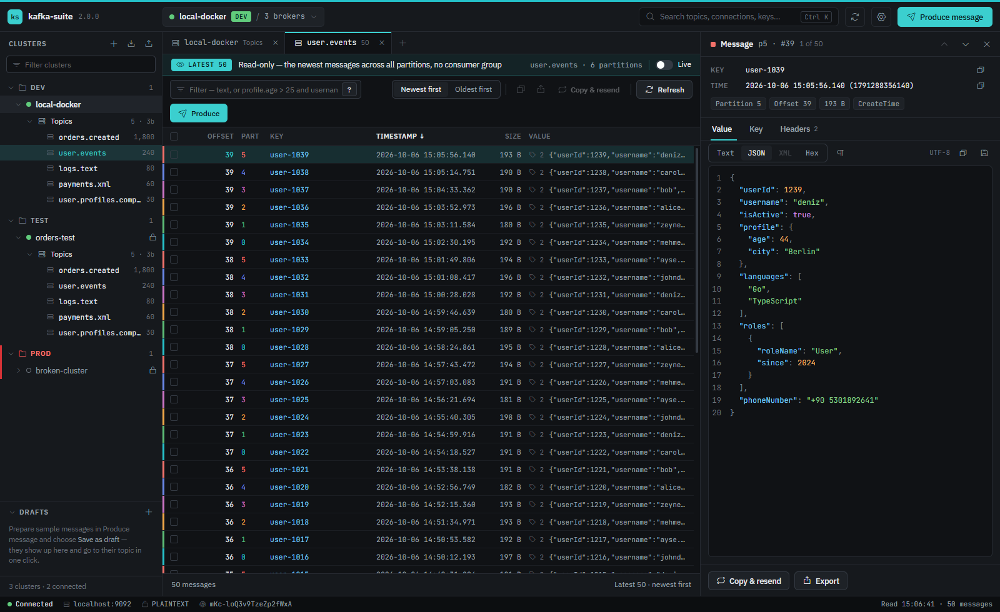
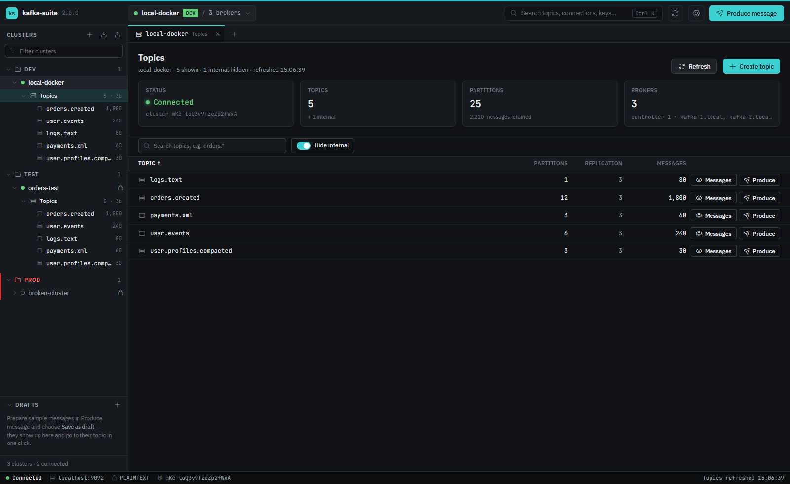
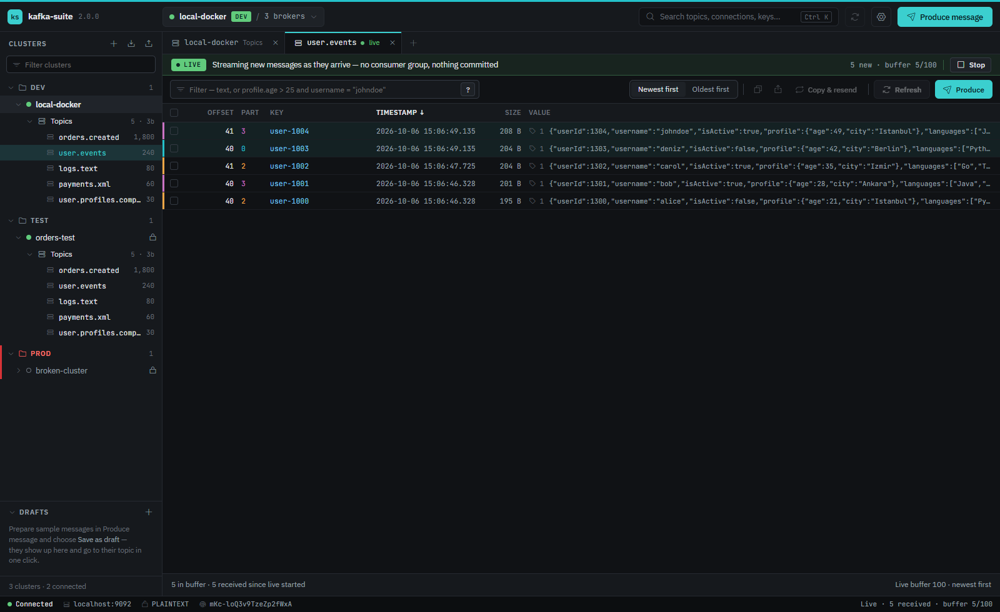
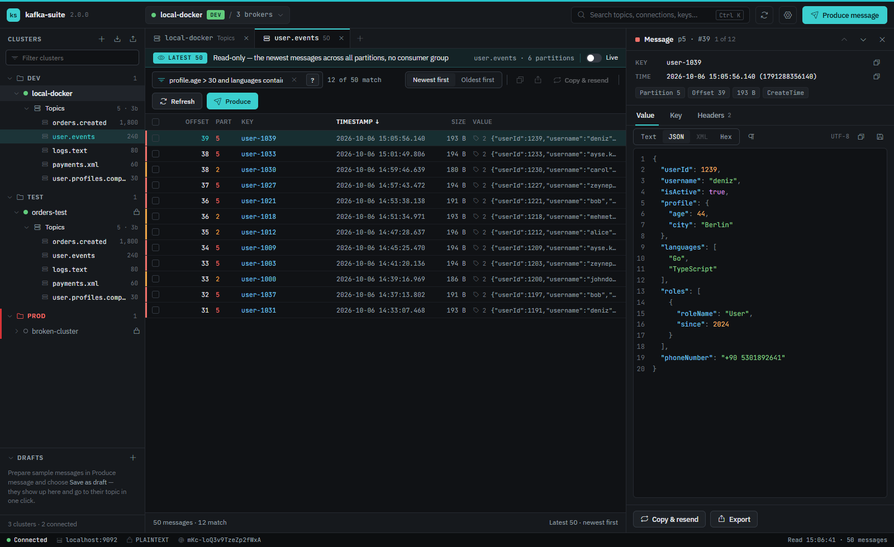
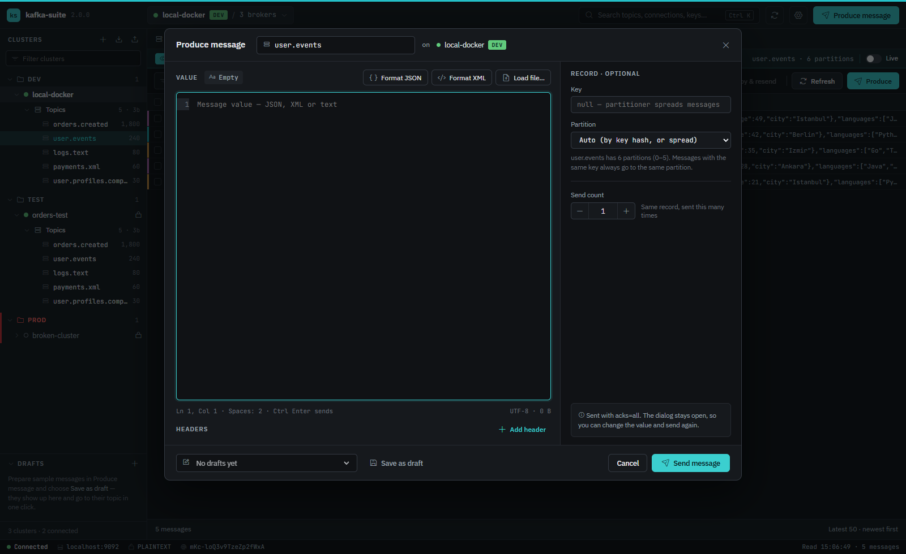
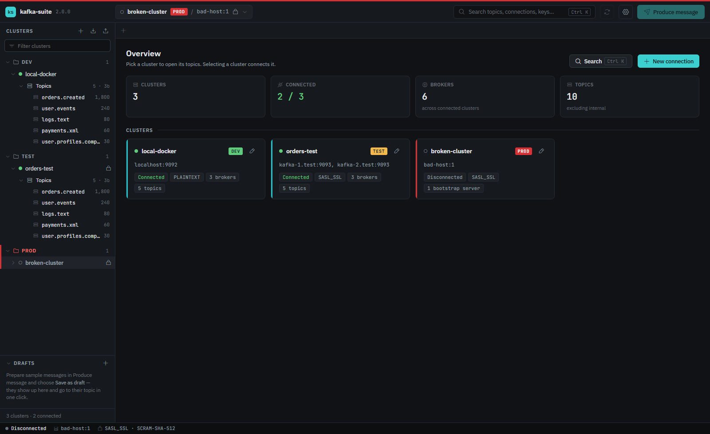
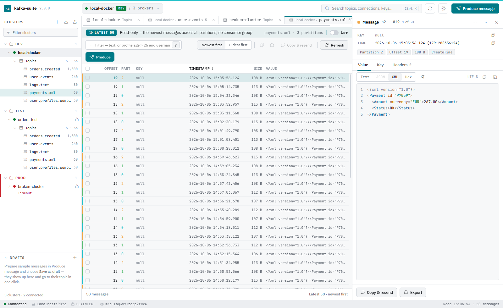
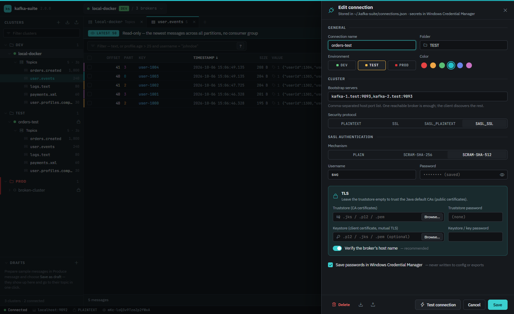
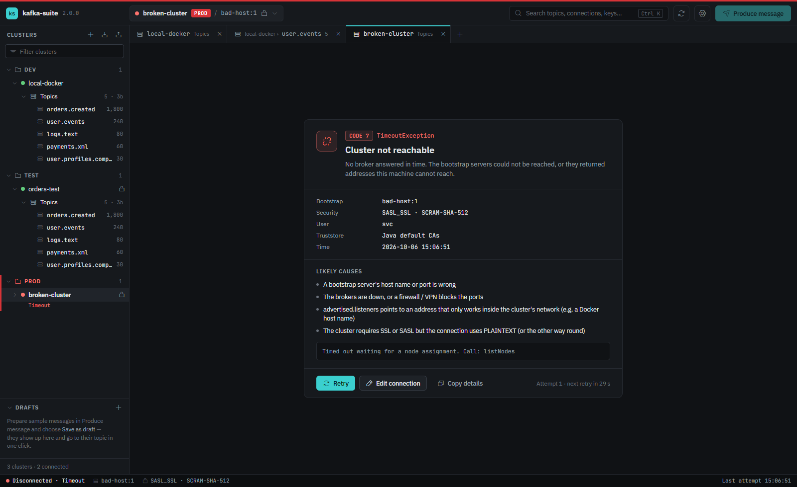

# Kafka Suite

A desktop app for working with Apache Kafka clusters. You can list a cluster's topics, read the latest messages or tail new ones live, filter them with a small query language, inspect values and headers, create topics and produce test messages.



## Features

- **Clusters:** Organise them in folders and tag each one as DEV, TEST or PROD with a colour. Selecting a cluster connects it. Connections can be exported to JSON and imported on another machine; passwords are never included in exports.
- **Security:** PLAINTEXT, SSL, SASL_PLAINTEXT and SASL_SSL with SASL PLAIN, SCRAM-SHA-256 or SCRAM-SHA-512. TLS takes a truststore and an optional client keystore (JKS, PKCS#12 or PEM); host name verification can be turned off for test clusters.
- **Passwords in the OS keychain:** Windows Credential Manager, macOS Keychain or Secret Service on Linux, under the service name `kafka-suite`.
- **Overview and topics:** Connected clusters with their real broker counts. Each cluster lists its topics with partitions, replication factor and retained message count, a search (`orders.*` works) and an option to hide internal topics.
- **Latest messages:** Opening a topic reads its newest messages across all partitions (50 by default). Partitions are assigned directly, so no consumer group is created and nothing is committed.
- **Live tail:** Shows new messages as they arrive, newest first, keeping the last 100 (configurable).
- **Query language:** Filter on JSON values, e.g. `profile.age > 25 and username = "johndoe"`, `languages contains "Python"`, `roles[0].roleName = Admin`, `phoneNumber is not null`, `not (isActive = true)`. Text without operators searches keys and values.
- **Message details:** The value can be shown as Text, JSON, XML or Hex, with a tab each for the key and the headers. Each partition gets its own colour.
- **Control characters:** Optionally shows CR, LF, TAB and ASCII controls such as SOH, STX and NUL as visible markers.
- **Produce:** A syntax-highlighted editor with JSON/XML formatting and loading a value from a file (binary too). You can set the key, the partition and headers, and send several copies. The dialog stays open, so you can send again.
- **Drafts:** Saved sample messages that remember their topic and cluster. Send one in a single click from the sidebar; PROD clusters ask first.
- **Create topic:** Partitions, replication factor and topic configs, with the common ones (`retention.ms`, `cleanup.policy`, …) one click away.
- **Error screens:** Show what failed (timeout, SASL, TLS, authorization…), its likely causes and a countdown to an automatic retry.
- Dark, light or system theme; `Ctrl+K` to search topics, clusters, drafts and message keys.

## Screenshots

| | |
|---|---|
|  |  |
| **Topics**: partitions, replication, retained messages, broker info | **Live tail**: new messages as they arrive, no consumer group |
|  |  |
| **Query**: `profile.age > 30 and languages contains "Go"` | **Produce**: value editor, key, partition, headers, drafts |
|  |  |
| **Overview**: every cluster at a glance | **Light theme**: XML value with highlighting |
|  |  |
| **Connection**: SASL, TLS stores, keychain | **Errors**: likely causes, automatic retry |

## Installation

Download the installer for your platform from [Releases](../../releases):

| Platform | Package |
|----------|---------|
| Windows | `.msi` or `-setup.exe` |
| Linux | `.deb`, `.rpm`, `.AppImage` |
| macOS | `.dmg` |

The Apache Kafka client and a Java runtime are bundled, so there is nothing else to install.

Connections saved by Kafka Suite 1.x (the Electron version) are imported the first time 2.x starts; their passwords move to the OS keychain.

## Architecture

```
┌──────────────── Tauri (Rust) ─────────────────┐   line-delimited JSON   ┌──── Java 21 sidecar ─────┐
│ React UI (src/)                               │   over stdin/stdout     │ Apache Kafka client      │
│ keychain, ~/.kafka-suite/*.json, file dialogs │ ◄─────────────────────► │ admin, consumer (assign) │
│ live-tail events → webview                    │                         │ producer, live tail      │
└───────────────────────────────────────────────┘                         └──────────────────────────┘
```

| Folder | What lives there |
|--------|------------------|
| `src/` | The UI: React, TypeScript and zustand. `src/lib/query.ts` is the message query language |
| `src-tauri/` | Desktop shell. Starts and supervises the sidecar, forwards live-tail events, fills saved secrets in from the keychain, reads/writes the local JSON files and imports 1.x connections |
| `sidecar/` | Kafka operations (`KafkaOps`), live tail (`LiveTail`), client settings (`Config`), one admin client and producer per cluster (`ClientPool`) |

There is no server; everything runs on your machine.

## Local data

| Location | Contents |
|----------|----------|
| `~/.kafka-suite/connections.json` | Connections, without secrets |
| `~/.kafka-suite/settings.json` | Theme, messages to read, live buffer, control-character display |
| `~/.kafka-suite/templates.json` | Drafts |
| `~/.kafka-suite/logs/sidecar.log` | Kafka client warnings and errors |
| OS keychain, service `kafka-suite` | Passwords under `<id>`, `<id>:truststore` and `<id>:keystore` |

## Development

Requirements: Node 22+, Rust (stable) and JDK 21+. Maven is not needed; use `sidecar/mvnw`.

```bash
npm install
npm run sidecar      # builds the sidecar jar and a jlink runtime into src-tauri/resources/
npm run tauri dev    # starts the app in development mode
```

For UI-only work, `npm run dev` opens the app in a browser with a mock backend.

Tests:

```bash
npm test                      # query language and helpers (100% coverage required: npm run test:coverage)
npm run typecheck
cd sidecar && ./mvnw test     # Java unit tests
cd src-tauri && cargo test    # Rust unit tests
```

A local Kafka for testing:

```bash
docker run -d --name kafka-suite-dev -p 9092:9092 apache/kafka:latest
```

Connect to `localhost:9092` with PLAINTEXT.

> On Windows, `cargo build` fails while Smart App Control is turned on, because it blocks the unsigned DLLs that Rust builds for its compile-time macros.

## Packaging

```bash
npm run tauri build
```

On Windows this produces MSI and NSIS installers under `src-tauri/target/release/bundle/`. Pushing a `v*` tag runs `.github/workflows/release.yml`, which runs the tests, builds the Windows, Linux and macOS packages and attaches them to a GitHub release.

## License

MIT
